# Sentinel Architecture

This document describes the architecture of the Sentinel autonomous AI infrastructure platform.

## Table of Contents

- [System Overview](#system-overview)
- [Component Architecture](#component-architecture)
- [Data Flow](#data-flow)
- [Security Architecture](#security-architecture)
- [Deployment Architecture](#deployment-architecture)

## System Overview

Sentinel is an autonomous infrastructure controller that integrates with InfraMind (the predictive brain) to form a closed feedback loop for managing AI/ML workloads.

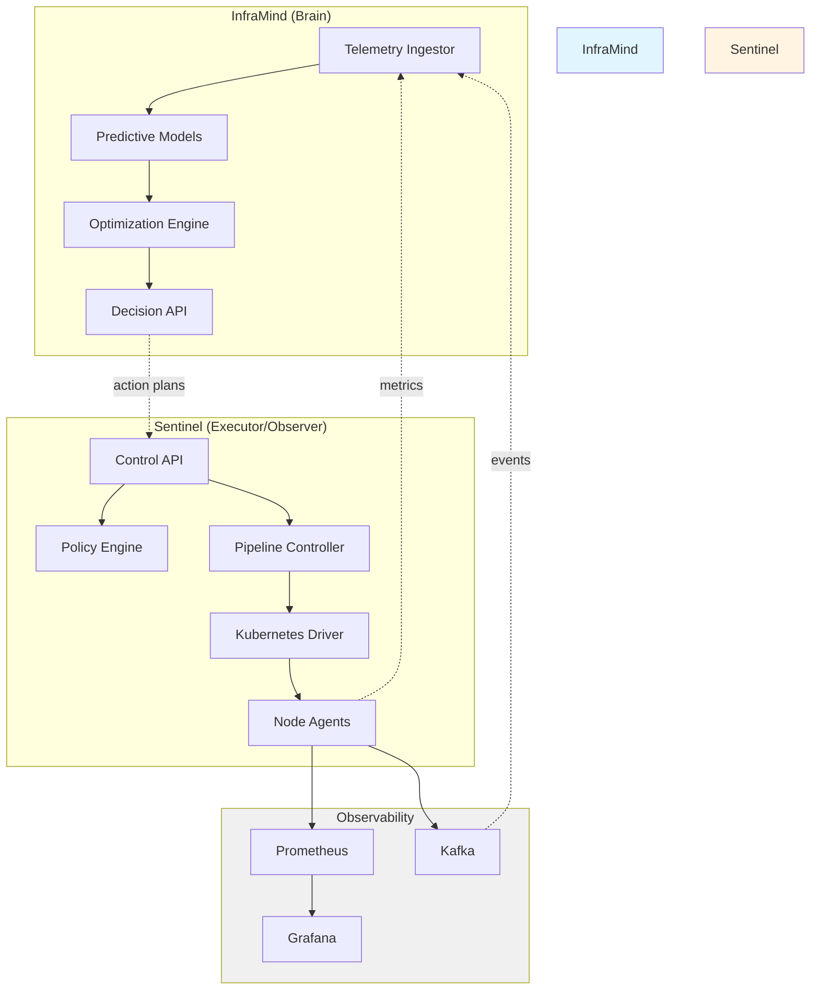

## Component Architecture

### Control API

The Control API is the primary interface for managing Sentinel operations.

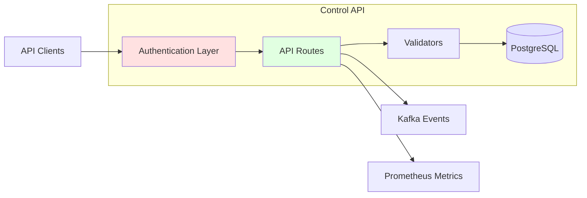

**Key Responsibilities:**
- JWT-based authentication and authorization
- RESTful API for workloads, deployments, policies
- Action plan submission and validation
- Audit logging

### Pipeline Controller

The Pipeline Controller executes deployment operations and manages workload lifecycle.

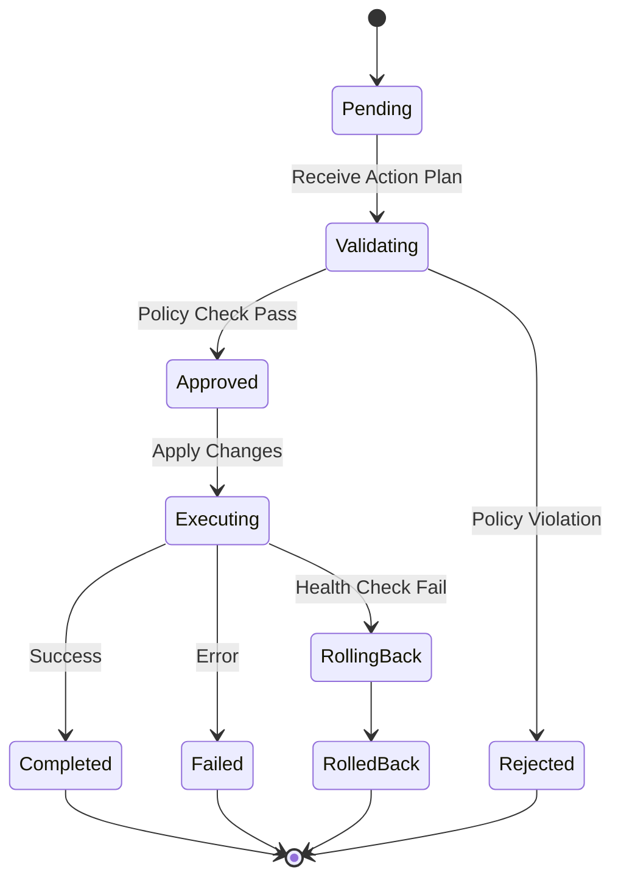

**Key Features:**
- Idempotent reconciliation loop
- Multiple rollout strategies (rolling, canary, blue/green)
- Automatic rollback on health check failures
- Integration with Kubernetes API

### Node Agent

The Node Agent collects metrics and executes scoped actions on individual nodes.

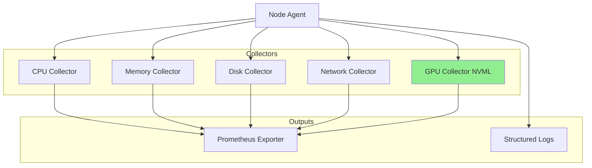

## Data Flow

### Telemetry Collection Flow

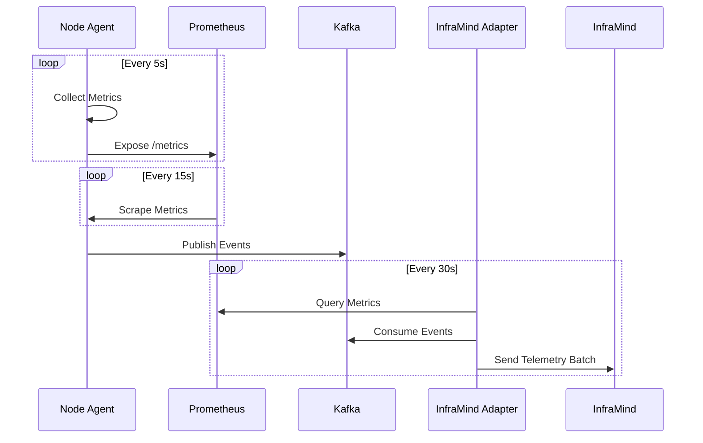

### Action Plan Execution Flow

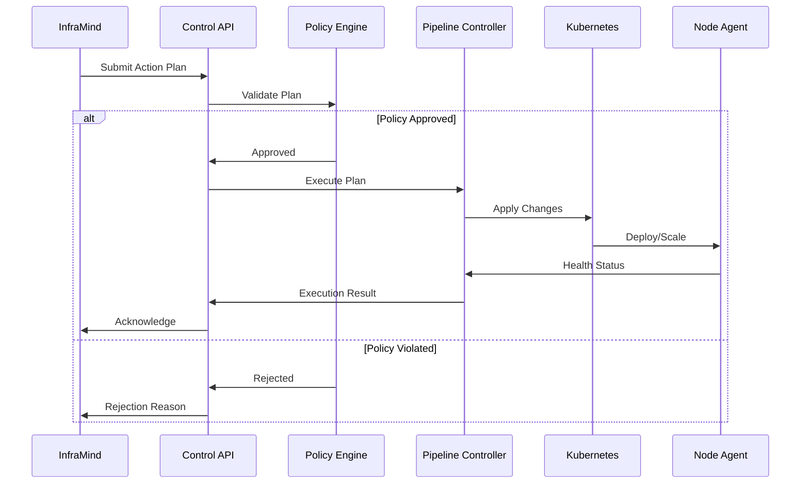

### Deployment Lifecycle

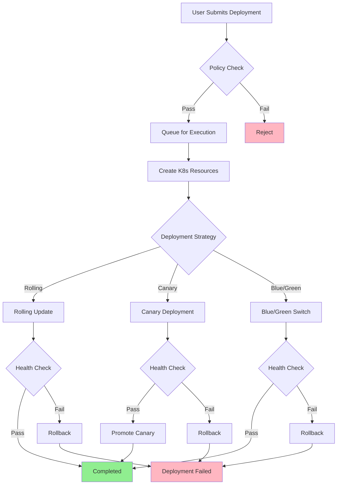

## Security Architecture

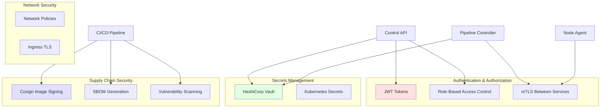

### Authentication Flow

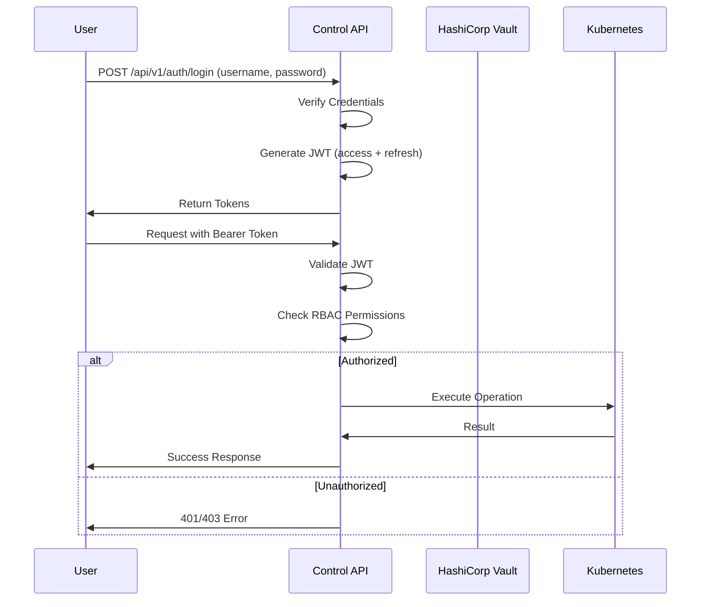

## Deployment Architecture

### Kubernetes Deployment

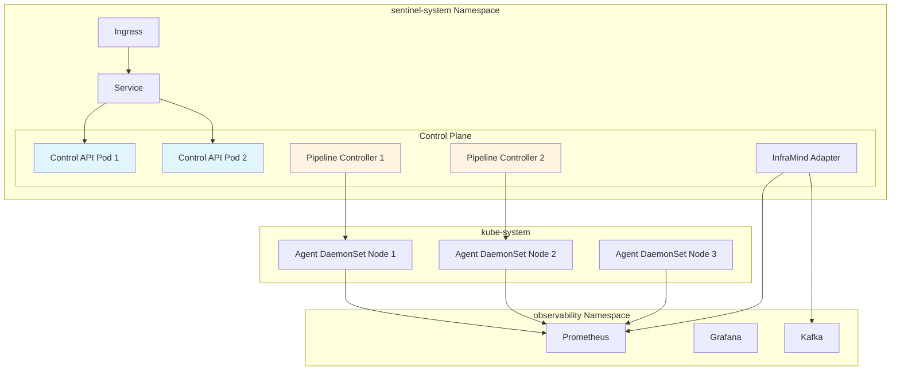

### Multi-Cluster Architecture

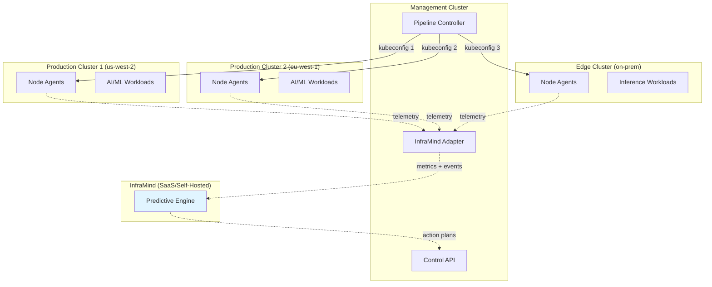

## Technology Stack

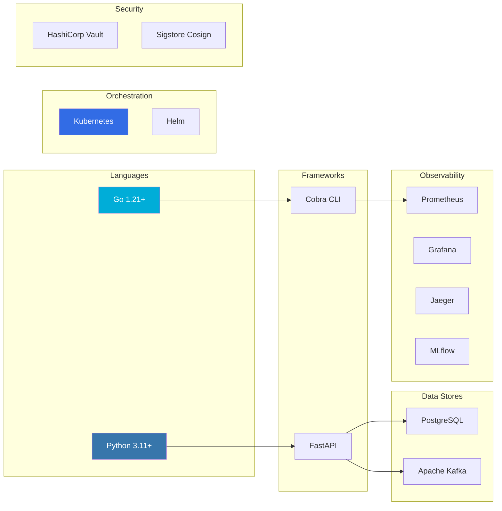

## Next Steps

- [API Reference](../api/openapi.yaml)
- [Development Guide](../guides/development.md)
- [Operator Runbook](../runbooks/operator-guide.md)
- [Security Model](../security.md)
